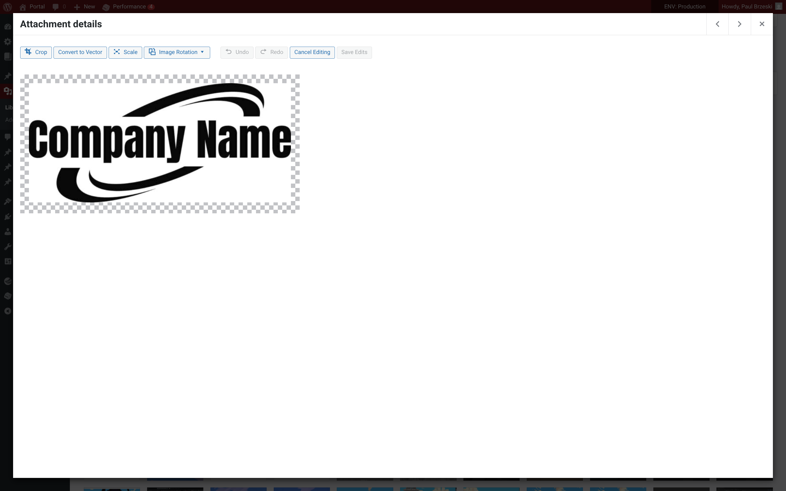
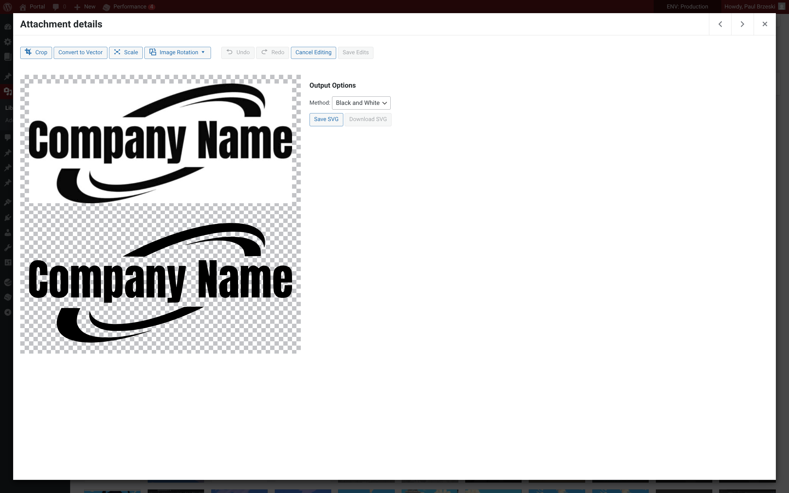
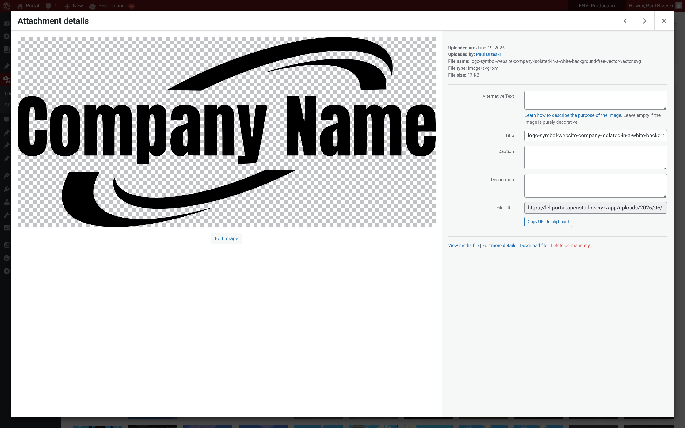

# Euclid

**Euclid** converts raster images (PNG, JPG) into clean, scalable SVGs directly in WordPress. Designed for designers, creators, and print workflows, Euclid makes it easy to generate vector graphics without leaving your site.

Extends native wp-admin/js/image-edit.js

## Features

- Convert logos, icons, or any raster images to SVG format.
- Optimized output for web or print.
- Admin-friendly interface integrated with the WordPress Media Library.
- Privacy-first: all conversions happen in-browser or on your server—no third-party API required.

## Use Cases

- **Web design** – create scalable icons and logos for your site.
- **Print-on-demand** – convert customer-uploaded images for T-shirts, mugs, or posters.
- **Digital art** – turn PNGs from AI tools or line art into clean SVGs.
- **Workflow optimization** – integrate SVG generation into your WordPress content pipeline.

## Installation

1. Upload the `euclid` folder to the `/wp-content/plugins/` directory.
2. Activate the plugin through the 'Plugins' menu in WordPress.
3. Go to **Media Library** to begin converting your images.

# Links
- Documentation & updates: https://openstudios.xyz
- Report issues or contribute: https://github.com/OpenStudiosCo/Euclid

## Screenshots

1. Convert image interface

2. Black & white SVG Preview
    

3. Black & white SVG Result

## Changelog

### 1.0.0
- Initial release: basic PNG/JPG to SVG conversion.
- Admin interface and Media Library integration.
- Privacy-first no external API conversion.
